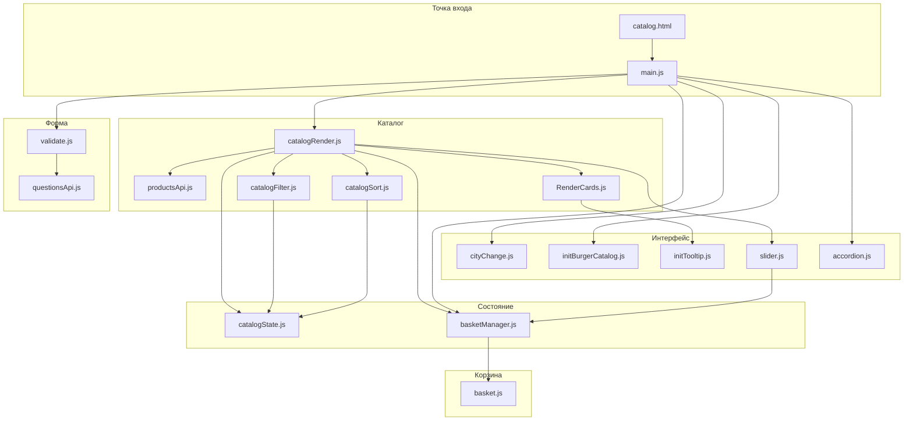

# 🛒 Маркетплейс на чистом JavaScript

**Интернет-магазин светильников Briaton — каталог, корзина и форма заявки без фреймворков**

[](https://developer.mozilla.org/en-US/docs/Web/HTML)
[](https://sass-lang.com/)
[](https://developer.mozilla.org/en-US/docs/Web/JavaScript)
[](https://developer.mozilla.org/en-US/docs/Web/JavaScript/Guide/Modules)

[Возможности](#-возможности) · [Запуск](#-запуск) · [Структура](#-структура-проекта) · [Стек](#-технологии)

---

## О проекте

Полнофункциональная витрина **каталога светильников** для бренда Briaton: карточки товаров, фильтрация, сортировка, корзина, слайдер «Товаров дня», FAQ и форма обратной связи.
Адаптивная вёрстка по **БЭМ**, клиентская логика на **ES-модулях** с чётким разделением слоёв: API, каталог, корзина, UI.

> Стек: нативный JavaScript, HTML5, SCSS. Работа с DOM, `fetch`, событиями и валидацией форм — без React, Vue и сборщиков.

---

## Возможности

| Раздел | Что реализовано |
|--------|-----------------|
| **Каталог** | Загрузка  товаров из `data.json`, карточки с ценой и наличием по городам |
| **Фильтры** | Тип светильника (чекбоксы), статус «В наличии» / «Все», сброс формы |
| **Сортировка** | По цене (возр./убыв.) и по рейтингу |
| **Пагинация** | По 6 товаров на страницу, переключение без перезагрузки |
| **Город** | Выбор Москвы, Оренбурга или Санкт-Петербурга — влияет на фильтр наличия |
| **Корзина** | Добавление, счётчик, удаление позиций, выпадающая панель в шапке |
| **Товары дня** | Слайдер на **Swiper** с навигацией |
| **Подсказки** | **Tippy.js** — наличие по складам в городах |
| **FAQ** | Аккордеон с плавным раскрытием |
| **Форма** | Валидация **JustValidate**, отправка на API, модальное окно успеха/ошибки |
| **UI** | Бургер-меню каталога, хлебные крошки, адаптивная сетка |

---

## Технологии

### Основа
- **HTML5** — семантическая разметка, доступность (`aria-label`, `visually-hidden`)
- **SCSS → CSS** — переменные, БЭМ-блоки, компонентный импорт в `scss/style.scss`
- **JavaScript (ES6+)** — классы, `async/await`, `fetch`, `DocumentFragment`, делегирование событий

### Библиотеки
| Библиотека | Назначение |
|------------|------------|
| [Swiper](https://swiperjs.com/) | Слайдер «Товары дня» |
| [Tippy.js](https://atomiks.github.io/tippyjs/) + Popper | Тултипы наличия |
| [JustValidate](https://just-validate.dev/) | Валидация формы заявки |

### Данные и API
- `data/data.json` — каталог товаров
- `https://httpbin.org/post` — отправка заявки с формы (POST)

---

## Архитектура



---

## Структура проекта

```
Vanilla-js-marketplace/
├── catalog.html          # главная страница каталога
├── data/
│   └── data.json         # данные товаров
├── css/
│   └── style.css         # скомпилированные стили
├── scss/                 # исходники стилей (БЭМ)
│   ├── style.scss
│   ├── global/
│   └── blocks/
├── images/
│   └── sprite.svg        # SVG-спрайт иконок
└── js/
    ├── main.js           # инициализация приложения
    ├── config/           # константы (размер страницы каталога)
    ├── state/            # catalogState, basketManager
    ├── components/
    │   ├── api/            # запросы к данным и API
    │   ├── catalog/        # рендер, фильтры, сортировка
    │   ├── basket/         # рендер корзины
    │   ├── formSubmit/     # форма и модалка
    │   └── UI/             # слайдер, аккордеон, тултипы
    └── vendor/             # Swiper, Tippy, JustValidate
```

---

## Запуск

### Требования
- Современный браузер с поддержкой **ES-модулей**
- Локальный HTTP-сервер *(модули не работают при открытии файла через `file://`)*

### Вариант 1 — Python
```bash
git clone https://github.com/KuzPaul/Vanilla-js-marketplace.git
cd Vanilla-js-marketplace
python3 -m http.server 8080
```
Откройте в браузере: **http://localhost:8080/catalog.html**

### Вариант 2 — Live Server (VS Code)
1. Установите расширение **Live Server**
2. Откройте `catalog.html` → **Go Live**

### Вариант 3 — Node.js
```bash
npx serve .
```

После включения **GitHub Pages**: https://kuzpaul.github.io/Vanilla-js-marketplace/catalog.html

---

## Автор

**Павел Кузнецов** — [GitHub @KuzPaul](https://github.com/KuzPaul)
